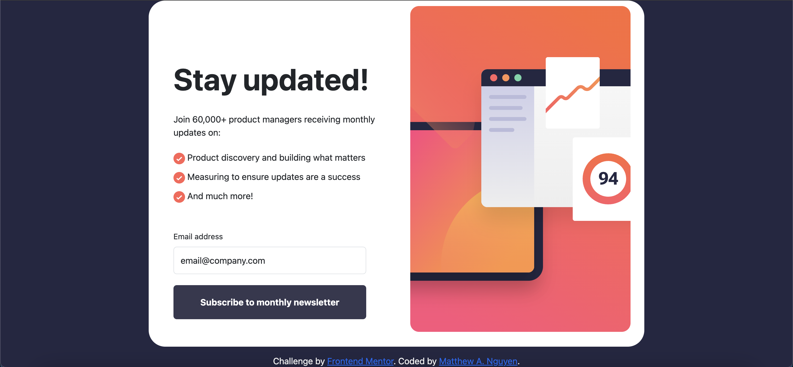

# Newsletter sign-up form 


## Table of contents

- [Overview](#overview)
  - [The challenge](#the-challenge)
  - [Screenshot](#screenshot)
  - [Links](#links)
- [My process](#my-process)
  - [Built with](#built-with)
  - [What I learned](#what-i-learned)
  - [Continued development](#continued-development)
  - [Useful resources](#useful-resources)
- [Author](#author)
- [Acknowledgments](#acknowledgments)


## Overview

In this project, we created a simple Frontend UI that allows a user to subscribe to a newsletter. This project involves form validation that checks to see if the email is valid, or if the input field is NOT left blank. 

If the email is valid upon submission, the webpage is then rendered with new content on the page, displaying that they have successfully subscribed using their email. 

## The challenge

### User Story

```
AS a user
I WANT to subscribe to a newsletter using my email address
SO THAT I can receive newsletters to my email
```

### Acceptance Criteria

```
GIVEN a pretty user interface
WHEN I input my email and click on the button
THEN I am presented with new content on the page that displays that I successfully subscribed
```
### Screenshot



### Links

- [Github Repo URL](https://github.com/mattwhen/newsletter-signup)
- [Deployed application](https://mattwhen.github.io/newsletter-signup/)

## My process

### Built with

- Semantic HTML5 markup
- CSS custom properties
- Flexbox
- CSS Grid
- Vanilla Javascript
- Mobile-first workflow
- Bootstrap

### What I learned

Use this section to recap over some of your major learnings while working through this project. Writing these out and providing code samples of areas you want to highlight is a great way to reinforce your own knowledge.

To see how you can add code snippets, see below:

```html
<h1>Some HTML code I'm proud of</h1>
```
```css
.proud-of-this-css {
  color: papayawhip;
}
```
```js
const proudOfThisFunc = () => {
  console.log('🎉')
}
```

### Continued development

Use this section to outline areas that you want to continue focusing on in future projects. These could be concepts you're still not completely comfortable with or techniques you found useful that you want to refine and perfect.

### Useful resources

- [stackoverflow](https://stackoverflow.com/questions/19572044/changing-html-content-order-depending-on-screen-size) - This helped me change the HTML content order based on the pixel size of the user's device.
- [Example resource 2](https://www.example.com) - This is an amazing article which helped me finally understand XYZ. I'd recommend it to anyone still learning this concept.


## Author

- [Matthew A. Nguyen]()
- [Frontend Mentor](https://www.frontendmentor.io/profile/yourusername)
- [Twitter](https://twitter.com/matt_alexanderr)
- [LinkedIn](https://www.linkedin.com/in/matthew-nguyen-1724b9132/)

**Note: Delete this note and add/remove/edit lines above based on what links you'd like to share.**

## Acknowledgments

This is where you can give a hat tip to anyone who helped you out on this project. Perhaps you worked in a team or got some inspiration from someone else's solution. This is the perfect place to give them some credit.

**Note: Delete this note and edit this section's content as necessary. If you completed this challenge by yourself, feel free to delete this section entirely.**
