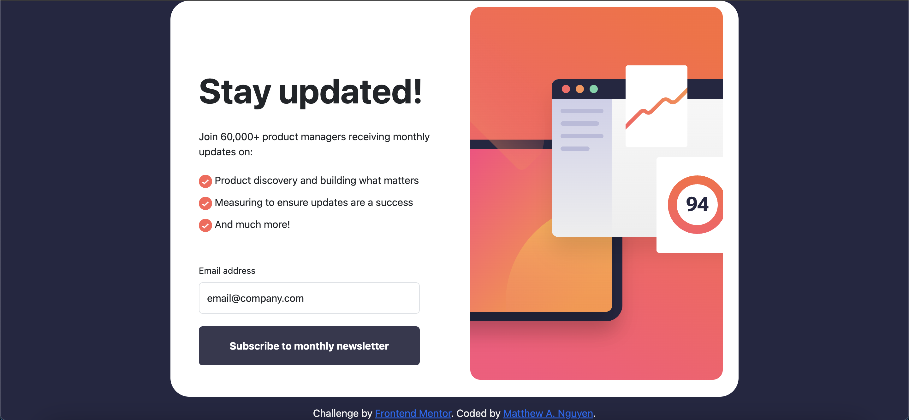

# Newsletter sign-up form 


## Table of contents

- [Overview](#overview)
  - [The challenge](#the-challenge)
  - [Screenshot](#screenshot)
  - [Links](#links)
- [My process](#my-process)
  - [Built with](#built-with)
  - [What I learned](#what-i-learned)
  - [Continued development](#continued-development)
  - [Useful resources](#useful-resources)
- [Author](#author)
- [Acknowledgments](#acknowledgments)


## Overview

In this project, we created a simple Frontend UI that allows a user to subscribe to a newsletter. This project involves form validation that checks to see if the email is valid, or if the input field is NOT left blank. 

If the email is valid upon submission, the webpage is then rendered with new content on the page, displaying that they have successfully subscribed using their email. 

## The challenge

### User Story

```
AS a user
I WANT to subscribe to a newsletter using my email address
SO THAT I can receive newsletters to my email
```

### Acceptance Criteria

```
GIVEN a pretty user interface
WHEN I input my email and click on the button
THEN I am presented with new content on the page that displays that I successfully subscribed
```
### Screenshot



### Links

- [Github Repo URL](https://github.com/mattwhen/newsletter-signup)
- [Deployed application](https://mattwhen.github.io/newsletter-signup/)

## My process
I first began this project by building out all the HTML that needs to be rendered onto the page. Then I started working on the CSS to style the panel and have all our HTML nested inside of it. I used Boostrap to style the button on the page, although I could have built the button myself. 

After creating the desktop layout, I then proceeded to building out the mobile layout. Although, the mobile layout should have been the first to design first for many reasons from what I researched. Some research I've looked into is by the fact most users in the world all have a mobile device, and has surpassed the amount of time spent on Desktops. 

I found this article from <i>[medium.com](https://medium.com/@Vincentxia77/what-is-mobile-first-design-why-its-important-how-to-make-it-7d3cf2e29d00#:~:text=In%20short%2C%20the%20%E2%80%9Cmobile%20first,created%20neat%20and%20practical%20designs)</i> that goes into greater detail on why mobile first design is far better than starting with the Desktop layout.

I then proceeded to using only Vanilla JS to customize the functionality of rendering new content and form validation that displayed either a success or error visual to the user upon the form submission. I wanted to focus on not using any frameworks or libraries for this, so I could further develop a deeper understanding on how JavaScript works when creating dynamic web pages.

### Built with

- Semantic HTML5 markup
- CSS custom properties
- Flexbox
- Vanilla Javascript
- Bootstrap

### Continued development

Use this section to outline areas that you want to continue focusing on in future projects. These could be concepts you're still not completely comfortable with or techniques you found useful that you want to refine and perfect.

For future developments, the most obvious one to me is implementing some sort of Backend technology. Although this is mainly just a Frontend project, some features I would love to include is some more dynamic functionality such as re-sizing the panel after the form submission instead of rendering new content immediately onto the page. Also, add some thinking/processing wheel onto the button after the form is submitted to signal to the user that their form is in the process of being submitted. Right now, the input form just highlights the border in green upon a successful submission. 

### Useful resources

- [stackoverflow](https://stackoverflow.com/questions/19572044/changing-html-content-order-depending-on-screen-size) - This helped me change the HTML content order based on the pixel size of the user's device.
- [JavaScript Tutorial](https://www.javascripttutorial.net/javascript-dom/javascript-form-validation/) - This is an amazing article which helped me finally understand form validation and error handling.


## Author

- Matthew A. Nguyen
- [Design by Frontend Mentor](https://www.frontendmentor.io/profile/yourusername)
- [Twitter](https://twitter.com/matt_alexanderr)
- [LinkedIn](https://www.linkedin.com/in/matthew-nguyen-1724b9132/)


